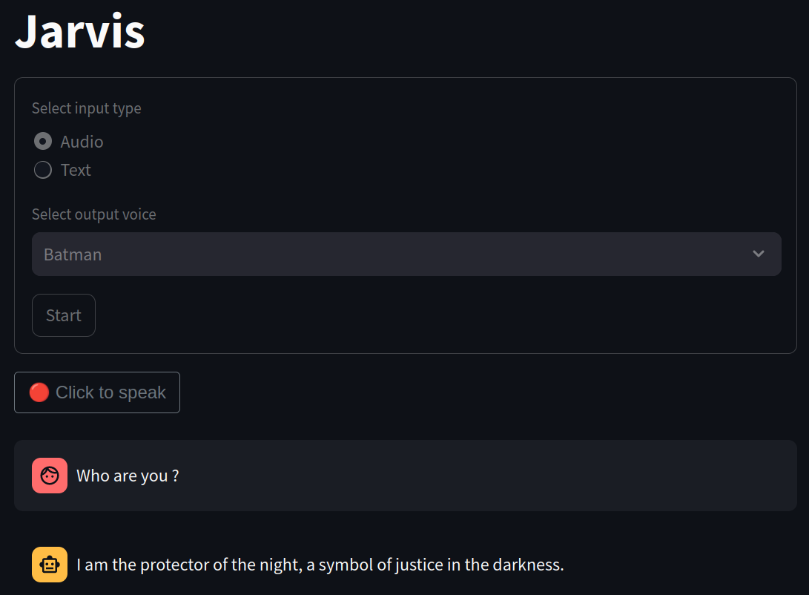

# jarvis
AI assistant based on chat GPT with voice input ([whisper](https://openai.com/research/whisper)) and output ([ElevenLabs](https://elevenlabs.io/)).
- **Frontend:** Streamlit
- **Backend:** Fastapi




## 💻 Local Deployment
1. Fill the `.env` file with the openai and elevenlabs api keys.
2. Build and run the app: `docker compose up -d`

The app should be availabe at `http://localhost:8501`

## 🚀 Kubernetes Deployment
Follow this guide to deploy the app on AWS EKS
**Prerequisites:**
- AWS CLI
- Required IAM permissions (vpc, ecr, eks, iam, route53)
- Kubectl
- Terraform

### Infra
**Setup**: Create the terraform [S3 backend](https://developer.hashicorp.com/terraform/language/settings/backends/s3)

Fill `infra/live/backend.conf`. Remove the kms_key_id in this step. 

```bash
cd infra/setup
terraform init
terraform plan -var-file ../live/backend.conf -out tf.plan
terraform apply tf.plan
``` 
This should output the `kms_key_arn`. Set it in `infra/live/backend.conf` as `kms_key_id`.

**Live**: Create vpc, ecr, eks and iam

Requirements:
- `04-iam` creates a role for cert manager to access the route53 dns solver. This assumes you have configured a route53 hosted zone. 

Fill `infra/live/project.conf`, then create each service, one by one, from `01-vpc` to `04-iam`:

```bash
cd infra/live/0x-xxx
terraform init -backend-config="../backend.conf"
terraform plan -var-file ../project.conf -out tf.plan
terraform apply tf.plan
```  

Configure kubectl with the command in the eks `configure_kubectl` output: `"aws eks --region ${region} update-kubeconfig --name ${cluster_name}`  

### Deployments
Build and push back and front docker images to ecr:
```bash
# back
docker build -t ${ecr_back_registry}  -f ops/back/Dockerfile .
docker push ${ecr_back_registry}:latest

# front
docker build -t ${ecr_front_registry}  -f ops/front/Dockerfile .
docker push ${ecr_front_registry}:latest
```

Install ansible and kubernetes dependencies
```bash
poetry install --only ops
```

Fill config in `deployments/inventory/group_vars/all.yaml`

Deploy app, ingress-nginx and cert-manager
```bash
cd deployments
ansible-playbook playbooks/app.yaml -i inventory
ansible-playbook playbooks/ingress.yaml -i inventory
ansible-playbook playbooks/cert_manager.yaml -i inventory
``` 

The app sould be available at `https://my.domain-name.fr`